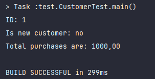

# Основне завдання

### Код Customer.java
```
package domain;

public class Customer {

    private int id = 1;
    private boolean newCustomer = false;
    private double total = 1000;
}
```

## Завдання 2

### Код Customer.java
```
package domain;

public class Customer {

    private int id = 1;
    private boolean newCustomer = false;
    private double total = 1000;
    
   public void displayCustomerInfo() {
        System.out.printf("ID: %d", id);
        System.out.printf("Is new customer: %s", (newCustomer ? "yes" : "no"));
        System.out.printf("Total purchases are: %f", total);
    }
}
```
## Завдання 3

### Код CustomerTest.java
```
package test;

import domain.Customer;

public class CustomerTest {

    public static void main(String[] args) {
        Customer customer = new Customer();
        customer.displayCustomerInfo();
    }
}
```

### Результат виконання

